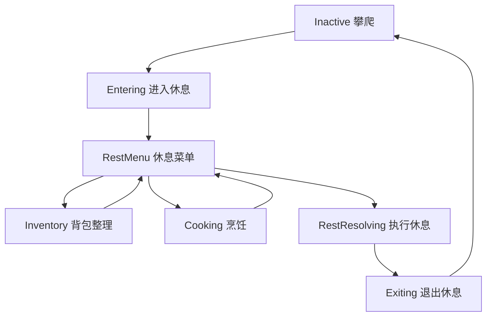

# Rise 休息系统程序策划

## 0. 目标

休息不是简单按键回血，而是一个短暂的安全状态切换：玩家从危险山体进入“帐篷内/营地内”的感觉，环境压力降低，可以整理背包、烹饪，最后选择休息并结束该界面。

当前 Unity 工程根目录：`E:\数据库\rise\rise\Rise`

---

## 1. 核心体验

进入休息后，系统应制造明确的“脱离外部暴露环境”的感觉：

- 摄像头移动到对应休息点。
- 人物隐藏，避免玩家误以为仍在攀爬控制状态。
- 风声和外部环境声降低。
- 可加入帐篷内布料摩擦、轻微呼吸、炉火或燃料声音。
- 右侧出现休息菜单：背包整理、烹饪、休息。
- 点击“休息”后根据短休/长休恢复对应属性，然后退出休息状态。

---

## 2. 休息状态机

建议新增 `RestSessionController` 管理完整流程，不要继续把休息 UI、镜头、音频全部写进 `PlayerClimbController`。

| 状态 | 说明 | 可输入 |
|---|---|---|
| `Inactive` | 默认攀爬状态 | 攀爬输入 |
| `Entering` | 按 F 后进入休息，释放双手，冻结角色 | 无，等待过渡 |
| `RestMenu` | 休息主菜单显示，右侧有三个选项 | 点击菜单 |
| `Inventory` | 打开大小背包整理界面 | 背包操作，返回 |
| `Cooking` | 打开烹饪菜单 | 烹饪操作，返回 |
| `RestResolving` | 点击休息后播放短暂结算 | 无，等待恢复完成 |
| `Exiting` | 镜头、音频、人物恢复到攀爬状态 | 无，等待过渡 |

状态流：



---

## 3. 进入休息流程

触发条件：

- 玩家进入 `RestPoint` 触发范围。
- HUD 显示休息提示。
- 玩家按 F。
- 当前不是胜利状态、不是已经休息中、不是背包/资源点 UI 状态。

进入步骤：

1. `PlayerClimbController` 释放左右手。
2. 冻结玩家刚体，清空当前速度。
3. 记录玩家进入前位置和镜头状态。
4. 人物模型隐藏。
5. 摄像头切换到休息点镜头目标。
6. 环境音混音进入“帐篷内”状态。
7. 显示右侧休息菜单。

---

## 4. 摄像头规则

### 4.1 RestPoint 数据

`RestPoint` 建议增加字段：

| 字段 | 类型 | 说明 |
|---|---|---|
| `CameraFocus` | `Transform` | 休息时镜头看向的位置 |
| `CameraOffset` | `Vector3` | 休息镜头偏移 |
| `CameraSize` | `float` | 正交相机尺寸，若使用正交 |
| `EnterCameraDuration` | `float` | 进入休息镜头过渡时长，建议 0.6 秒 |
| `ExitCameraDuration` | `float` | 退出休息镜头过渡时长，建议 0.4 秒 |

### 4.2 镜头表现

- 短休息点：镜头移动到平台/避风点，保留部分外部环境。
- 长休息点：镜头移动到帐篷或营地中心，让玩家感觉进入安全空间。
- 镜头过渡使用平滑插值，不硬切。
- 休息 UI 出现前，镜头过渡至少完成 70%，避免 UI 和镜头同时抢注意力。

建议接口：

```csharp
public void EnterRestView(RestPoint restPoint);
public void ExitRestView(Transform playerTarget);
```

`CameraFollowSideView` 后续可以增加 `OverrideTarget` 或 `CameraMode`，在休息时临时脱离玩家跟随。

---

## 5. 人物隐藏与输入冻结

进入休息：

- 隐藏人物表现层，例如 `CharacterPresentation` 或角色模型根节点。
- 保留玩家逻辑对象和碰撞位置。
- `Rigidbody.isKinematic = true`。
- 关闭攀爬输入、工具输入、蹬腿输入。
- 背包/烹饪 UI 输入仍然可用。

退出休息：

- 人物重新显示。
- 摄像头回到玩家。
- `Rigidbody.isKinematic = false`。
- 重置自由手目标到角色附近。
- 恢复攀爬输入。

注意：不要销毁玩家对象，也不要改变检查点逻辑。长休息才更新检查点。

---

## 6. 音频混音

休息时需要像待在帐篷里：

| 音频组 | 进入休息 | 退出休息 |
|---|---|---|
| 风声 | 降低到 25%-35% | 恢复到 100% |
| 外部环境声 | 降低到 30%-40% | 恢复到 100% |
| 攀爬动作声 | 静音或大幅降低 | 恢复 |
| 帐篷内氛围 | 淡入到 100% | 淡出 |
| 篝火/燃料声 | 长休息点淡入 | 淡出 |
| 呼吸声 | 低体力时可保留轻微呼吸 | 恢复正常规则 |

建议新增 `RestAudioController`：

```csharp
public void EnterRestMix(RestPointType restType);
public void ExitRestMix();
```

默认混音时长：

- 进入休息：0.8 秒。
- 退出休息：0.5 秒。

---

## 7. 右侧休息菜单

进入休息后右侧出现纵向菜单。

| 按钮 | 短休息点 | 长休息点 | 行为 |
|---|---|---|---|
| 背包整理 | 可用，但只显示小背包 | 可用，显示小背包 + 大背包 | 进入 `Inventory` 状态 |
| 烹饪 | 禁用 | 可用 | 进入 `Cooking` 状态 |
| 休息 | 可用 | 可用 | 执行恢复并结束休息 |

菜单规则：

- 右侧菜单保持在屏幕右边，不遮挡休息点主体。
- 当前子界面打开时，右侧菜单可以缩起或保留返回按钮。
- 禁用按钮需要显示原因，例如“短休息点不能烹饪”。
- 点击“休息”是最终确认操作，执行后退出休息界面。

---

## 8. 背包整理

点击“背包整理”：

- 短休息点：打开小背包 4x4，只允许整理立即可用物品。
- 长休息点：打开小背包 4x4 + 大背包 6x6。
- 长休息点允许在大小背包之间拖拽、旋转、F 快速移动。
- 整理界面有“返回休息菜单”按钮。

实现调用：

```csharp
InventoryUI.OpenRestInventory(RestPointType restType);
```

限制：

- 背包整理不直接恢复属性。
- 背包整理不结束休息。
- 玩家可以整理完返回主菜单，再选择烹饪或休息。

---

## 9. 烹饪菜单

点击“烹饪”：

- 只有长休息点可用。
- 打开烹饪菜单。
- 显示可制作配方、缺少材料的配方、制作效果。
- 玩家选择配方后消耗背包材料并立即应用效果。
- 烹饪后仍停留在休息状态，玩家可以继续整理背包或点击休息。

建议界面字段：

| 字段 | 说明 |
|---|---|
| 配方名 | 例如热食、保温休整、完整急救 |
| 消耗物品 | 显示食物、燃料、医疗包等材料 |
| 恢复效果 | 显示饥饿、温暖、健康、理智变化 |
| 可制作状态 | 材料足够时高亮 |

---

## 10. 点击休息后的结算

点击“休息”后，根据休息点类型恢复属性，然后退出休息。

### 10.1 短休息

效果：

- 攀爬体力 +35。
- 温暖 +2。
- 理智 +4。
- 不更新检查点。
- 不保存。
- 不打开大背包。
- 不烹饪。

调用：

```csharp
PlayerVitals.RecoverForShortRest();
```

### 10.2 长休息

效果：

- 攀爬体力恢复到 100。
- 饥饿 +30。
- 温暖 +10。
- 理智 +20。
- 健康 +15。
- 更新检查点。
- 可触发保存。

调用：

```csharp
PlayerVitals.RestoreAllForLongRest();
```

---

## 11. UI 结构建议

建议新增：

| 脚本 | 职责 |
|---|---|
| `RestSessionController` | 管理休息状态机和流程 |
| `RestMenuPresenter` | 显示右侧休息菜单 |
| `RestCameraController` | 处理休息镜头过渡 |
| `RestAudioController` | 处理帐篷内混音 |
| `InventoryUI` | 背包整理界面 |
| `CookingUI` | 烹饪菜单 |

现有 `PlayerClimbController` 后续只负责：

- 检测当前 `RestPoint`。
- 按 F 请求进入休息。
- 在休息结束后恢复攀爬控制。

---

## 12. 最小实现顺序

1. 新增 `RestSessionController`，接管现有 `PerformRest()`。
2. 进入休息时释放双手、冻结玩家、隐藏人物。
3. 摄像头移动到 `RestPoint` 附近。
4. 显示右侧菜单：背包整理、烹饪、休息。
5. 点击休息后调用现有短休/长休恢复接口并退出。
6. 接入背包整理界面。
7. 接入烹饪菜单。
8. 接入音频混音。

---

## 13. 验收标准

- 玩家按 F 后摄像头会移动到对应休息点。
- 休息中人物不可见，攀爬输入不可用。
- 风声和外部环境声明显降低。
- 右侧菜单包含背包整理、烹饪、休息。
- 短休息点不能烹饪，不能打开大背包。
- 长休息点可以打开大小背包，可以进入烹饪菜单。
- 点击休息后按短休/长休恢复对应属性。
- 恢复结算完成后自动退出休息，人物和摄像头回到攀爬状态。
